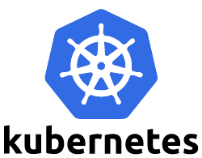
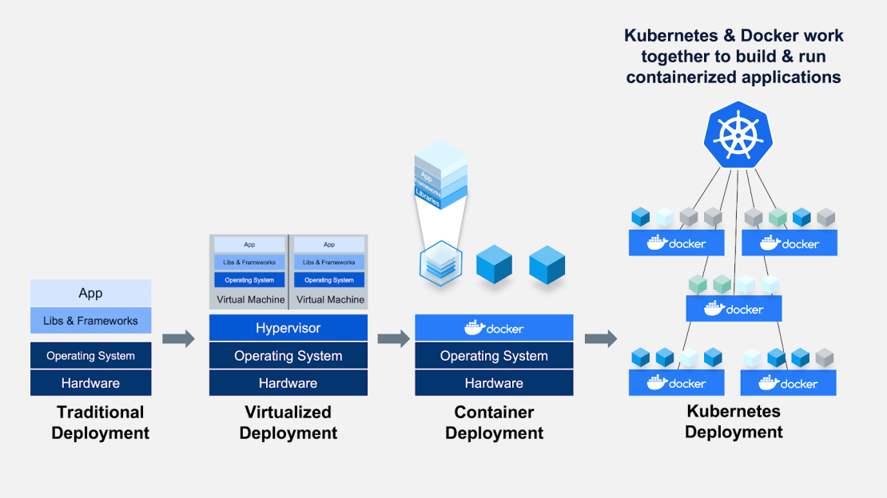
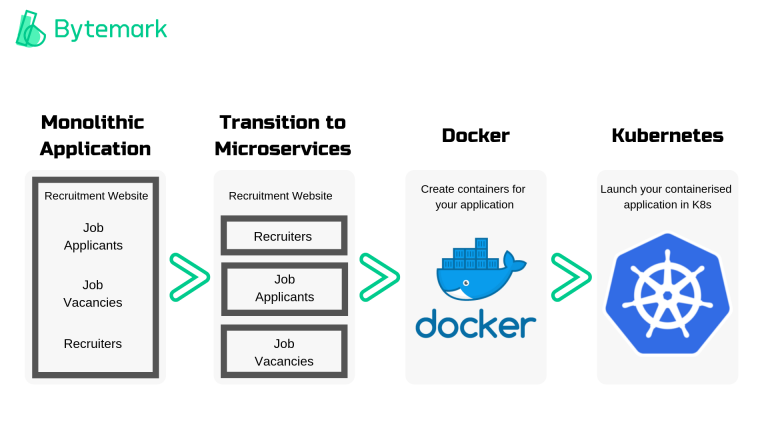
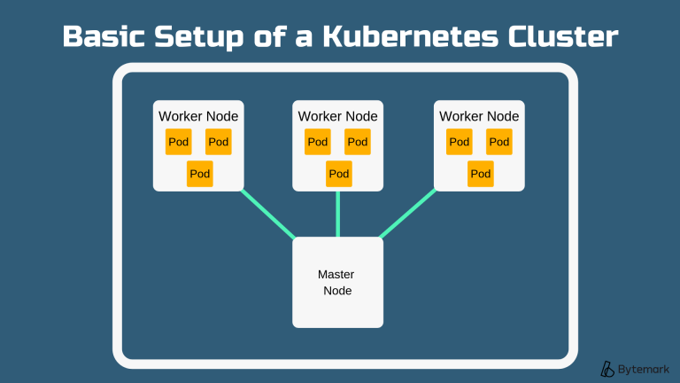
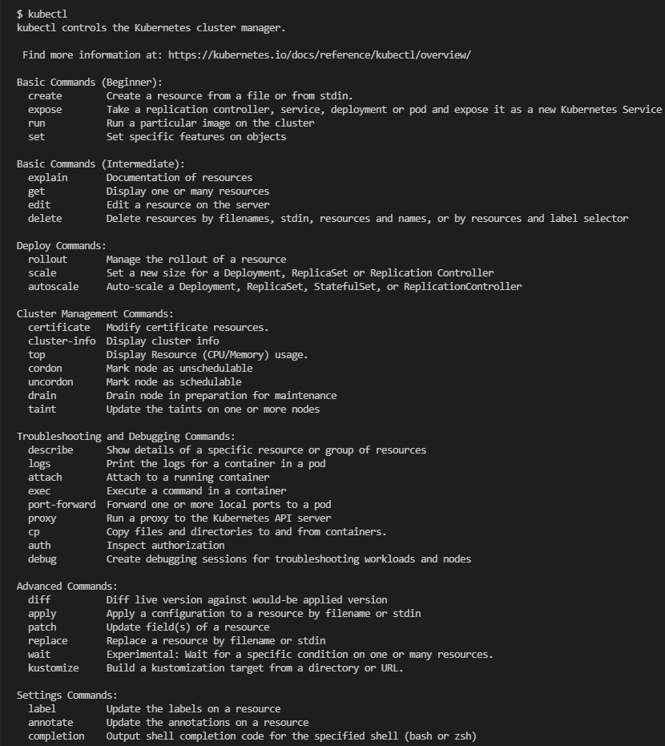
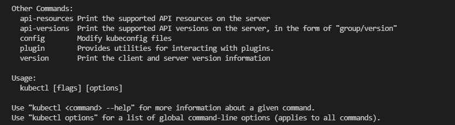
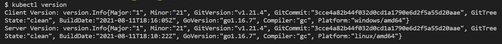
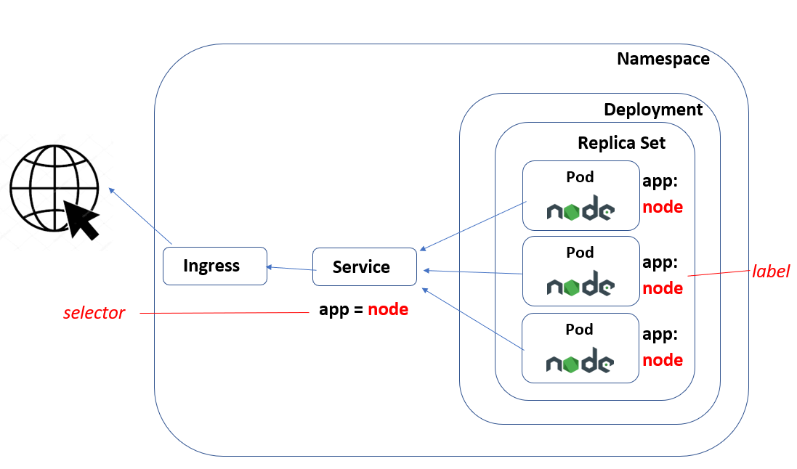

# Kubernetes (K8)



- [Kubernetes (K8)](#kubernetes-k8)
  - [What is Kubernetes? (K8)](#what-is-kubernetes-k8)
  - [Benefits of Kubernetes](#benefits-of-kubernetes)
  - [What are the differences between containers and virtual machines?](#what-are-the-differences-between-containers-and-virtual-machines)
  - [Definitions](#definitions)
    - [Pod](#pod)
    - [Nodes](#nodes)
    - [Master Node](#master-node)
    - [Cluster](#cluster)
  - [Kubernetes Installation](#kubernetes-installation)
  - [Nginx Deployment](#nginx-deployment)
    - [nginx-deploy.yml](#nginx-deployyml)
    - [nginx-service.yml](#nginx-serviceyml)
  - [Node App Deployment](#node-app-deployment)
    - [Ingress](#ingress)
    - [Service](#service)
    - [node_deploy.yml](#node_deployyml)
    - [node_svc.yml](#node_svcyml)
    - [node_hpa.yml](#node_hpayml)
  - [Mongo Deployment, PV and PVC](#mongo-deployment-pv-and-pvc)
    - [Tasks](#tasks)
    - [Persistent Volume (PV)](#persistent-volume-pv)
    - [Persistent Volume Claim (PVC)](#persistent-volume-claim-pvc)
    - [mongo_deploy.yml](#mongo_deployyml)
    - [mongo_service.yml](#mongo_serviceyml)
    - [mongo_pv.yml](#mongo_pvyml)
    - [mongo_pvc.yml](#mongo_pvcyml)

## What is Kubernetes? (K8)
- Open-source container orchestration platform
- PaaS
- Automates container behaviour
- Developed and run by Google
- K8 because there are 8 letters in the word "Kubernetes"




## Benefits of Kubernetes
- Service discovery and load balancing
- Easy to scale your application
- Keep code operational and speeds up the delivery process
- Portability and flexibility
  - K8 works with any type of container runtime
  - K8 works with any type of underlying infrastructure (public cloud, private cloud, on prem)
- Multi-cloud capability

## What are the differences between containers and virtual machines?


## Definitions
### Pod
- Holds one/more containers
- Any containers in the pod share resources and a network and can communicate with each other, even if they are on separate nodes
- Each pod has an IP address
- A pod can communicate with another pod by addressing its IP address, but mostly applications use Services to communicate

### Nodes
- Hardware components
- Virtual machine hosted by a cloud provider or a physical machine in a data centre
- CPU/RAM resources to be used by K8 cluster

### Master Node
- Controls deployment of pods and therefore worker nodes

### Cluster
- A series of nodes connected together
- Run the containerised applications managed by K8



## Kubernetes Installation
Prerequisites
- Docker Desktop

Installation
- Open Docker Desktop
- Go into settings -> Kubernetes -> Enable Kubernetes -> Click `Apply & Restart`
- In the terminal, type `kubectl` or `kubectl version` to check if installed
- `kubectl`




- `kubectl version`



## Nginx Deployment
- Create a nginx-deploy folder and create a nginx-deploy.yml file inside
### nginx-deploy.yml
```
---
apiVersion: apps/v1
kind: Deployment
metadata:
  name: nginx-deployment # naming the deployment

spec:
  selector:
    matchLabels:
      app: nginx # look for this label to match with k8 service
  
  # Let's create 2 replica sets of this instances/pods
  replicas: 2

  # template to use iy's label for k8 service to launch in the browser
  template:
    metadata:
      labels:
        app: nginx # This label connects to the service or any other
  
  # Let's define the container spec
    spec:
      containers:
      - name: nginx
        image: sachadorf/sre_customised_nginx:latest
        ports:
        - containerPort: 80
```
In terminal:
- Go into nginx-deploy folder `cd nginx-deploy`
- Run `kubectl create -f nginx-deploy.yml` (Should say `deployment.apps/nginx-deployment created`)
- `kubectl get pods` (Should show two nginx-deployment pods - They might have status ContainerCreating and then when you run the command again, they will say Running)
- `kubectl describe pod name_of_pod` (e.g. nginx-deployment-7bd7758b56-4vr7r)
- `kubectl get deploy`
- `kubectl describe deploy nginx-deployment`
- `kubectl edit deploy nginx-deployment`
- Edit the text file that comes up and change `replicas` from 2 to 3
- `kubectl get pods` - There should be three pods now
- Create a `nginx-service.yml` file in the nginx-deploy folder...
### nginx-service.yml
```
---
# Select the type of API version and type of service
apiVersion: v1
kind: Service
# Metadata for name
metadata:

  name: nginx-deployment
  namespace: default

# Specification to include ports Selector to connect
spec:
  ports:
  - nodePort: 30442
    port: 80
    protocol: TCP
    targetPort: 80

# Let's define the selector and label to connect to nginx
  selector:
    app: nginx # this label connects this service to deployment

  # Creating Loadbalancer type of deployment
  type: LoadBalancer
```
- `kubectl create -f nginx-service.yml`
- `kubectl get service`
- Delete one of the pods `kubectl delete pod nginx-deployment-7bd7758b56-bmdx9`
- `kubectl get pods` Should see another pod being created

- `kubectl get namespace`
- `kubectl create namespace name_of_namespace`


## Node App Deployment


### Ingress
- An API object that manages external access to the services in a cluster
- Can provide load balancing
### Service
- K8 Service identifies a set of Pods using label selectors that target specific pods (where the selector matches the label)
### node_deploy.yml
```
apiVersion: apps/v1
kind: Deployment
metadata:
  name: node
spec:
  selector:
    matchLabels:
      app: node
  replicas: 3
  template:
    metadata:
      labels:
        app: node
    spec:
      containers:
        - name: node
          image: sachadorf/sre_node_app:v1

          ports:
          - containerPort: 3000
          env:
          # - name: DB_HOST
            # value: mongodb://mongo:27017/posts
```
- The last two lines are commented out and can be included once we have configured our database

### node_svc.yml
```
apiVersion: v1
kind: Service
metadata:
  name: node
spec:
  selector:
    app: node
  ports:
    - port: 3000
      targetPort: 3000
  type: LoadBalancer
```

### node_hpa.yml
- This creates the Horizontal Pod Autoscaler which will automatically scale the number of Pods in our replica set based on CPU Utilisation (in this case)
```
apiVersion: autoscaling/v1
kind: HorizontalPodAutoscaler

metadata:
  name: sparta-node-app-deploy
  namespace: default

spec:
  maxReplicas: 9 # max number of instances/pods
  minReplicas: 3 # min number of instances/pods
  scaleTargetRef: # Targets the node deployment
    apiVersion: apps/v1
    kind: Deployment
    name: node
  targetCPUUtilizationPercentage: 50 # 50% of CPU use
```
## Mongo Deployment, PV and PVC
### Tasks
- Create deploy and service for mongo
- Create Persistent volume and PVC to claim storage
- Connect the app to db

### Persistent Volume (PV)
- A piece of storage that has been dynamically provisioned using Storage Classes

### Persistent Volume Claim (PVC)
- A request for storage by the user

### mongo_deploy.yml
```
apiVersion: apps/v1
kind: Deployment
metadata:
  name: mongo # naming

spec:
  selector:
    matchLabels:
      app: mongo # look for this label to match with k8 service
  replicas: 1
  # Let's define the container spec
  template:
    metadata:
      labels:
        app: mongo
    spec:
      containers:
        - name: mongo
          image: mongo
          ports:
          - containerPort: 27017
          # volumeMounts:
          # - name: storage
          #   mountPath: /data/db
      # volumes:
      #   name: test-volume
      #   hostPath:
      #    # directory location on host
      #     path: /data
      #     # this field is optional
      #     type: Directory
```
- The volume parts are commented out and will be included when we want to add a persistent volume
### mongo_service.yml
```
# Select the type of API version and type of service
apiVersion: v1
kind: Service
# Metadata for name
metadata:

  name: mongo
  namespace: default

# Specification to include ports Selector to connect
spec:
  ports:
    - port: 27017
      targetPort: 27017

# Let's define the selector and label to connect to nginx
  selector:
    app: mongo # this label connects this service to deployment
```
- Once you have the mongo deployment and service running, run the node deployment (uncommenting the env part) and the node service
- Run this command: `kubectl exec pod-name node seeds/seed.js` to seed the database
- You should see the posts page seeded and working on localhost:3000/posts
### mongo_pv.yml
```
apiVersion: v1
kind: PersistentVolume
metadata:
  name: mongo-pv
spec:
  accessModes:
    - ReadWriteOnce
  capacity:
    storage: 256Mi
  claimRef:
    name: mongo-pv-claim
    namespace: default
  hostPath:
    path: /data
    type: Directory
```
### mongo_pvc.yml
```
apiVersion: v1
kind: PersistentVolumeClaim
metadata:
  name: mongo-pv-claim
spec:
  accessModes:
    - ReadWriteOnce
  resources:
    requests:
      storage: 256Mi
```
